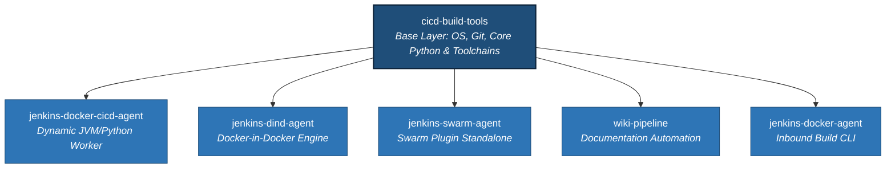

# Jenkins Distributed Automation Agents Collection

An enterprise-grade collection of optimized, purpose-built Docker agent configurations designed for a distributed Jenkins automation ecosystem. Organized into clear decoupled execution layers (base utilities vs. specialized downstream runtime pipelines), these profiles provide resilient build platforms for running multi-version CI/CD execution matrices, isolated testing harnesses, and documentation automation.

### Repository & Engine Metrics
[](https://github.com/lj020326/jenkins-docker-agent/actions/workflows/build-images.yml)
[](https://github.com/lj020326/jenkins-docker-agent/issues)
[](https://github.com/lj020326/jenkins-docker-agent/stargazers)

### Image Delivery Status
[](https://hub.docker.com/repository/docker/lj020326/cicd-build-tools/)
[](https://hub.docker.com/repository/docker/lj020326/jenkins-docker-cicd-agent/)
[](https://hub.docker.com/repository/docker/lj020326/cicd-docker-in-docker/)
[](https://hub.docker.com/repository/docker/lj020326/jenkins-dind-agent/)
[](https://hub.docker.com/repository/docker/lj020326/jenkins-swarm-agent/)
[](https://hub.docker.com/repository/docker/lj020326/wiki-pipeline/)

---

## 📐 Pipeline Topography

The images in this repository adhere to a strict structural dependency pipeline defined via `.github/images-config.yml`. The core base layer establishes the base operating system foundation, system-level software, and fundamental utilities, while all specialized agent profiles extend directly from it as decoupled consumer variants.



---

## 📦 Image Matrix & Manifest

### Base Platform Image
#### 🔹 `cicd-build-tools`
* **Source Context:** `image/cicd-build-tools/`
* **Dockerfile:** `image/cicd-build-tools/Dockerfile`
* **Documentation:** [image/cicd-build-tools/README.md](image/cicd-build-tools/README.md)
* **Role:** The immutable base operating layer. It encapsulates core system dependencies, system language locale overrides (`en_US.UTF-8`), and low-level development toolchains (`build-essential`). It serves as the single source of truth for downstream system binaries, helping minimize image bloat across the cluster.

### Dependent Worker Images
#### 🔹 `jenkins-docker-cicd-agent`
* **Source Context:** `image/jenkins-cicd-agent/`
* **Dockerfile:** `image/jenkins-cicd-agent/Dockerfile`
* **Documentation:** [image/jenkins-cicd-agent/README.md](image/jenkins-cicd-agent/README.md)
* **Role:** A dual-purpose runtime worker combining heavy isolated Python execution setups (packaged nicely into automated global `$PATH` environment definitions) alongside dedicated Java OpenJDK runtimes required to seamlessly register and manage state with the primary Jenkins orchestrator engine.

#### 🔹 `jenkins-dind-agent`
* **Source Context:** `image/jenkins-dind-agent/`
* **Dockerfile:** `image/jenkins-dind-agent/Dockerfile`
* **Documentation:** [image/jenkins-dind-agent/README.md](image/jenkins-dind-agent/README.md)
* **Role:** A Docker-in-Docker (DinD) isolated workspace context. Includes standard `docker-ce-cli` hooks and `buildx`/`compose` engine plugins mapped to custom internal host GIDs to safely run nested image builds, heavy integration testing blocks, or complex multi-container service mockings right inside a fleeting build step.

#### 🔹 `jenkins-swarm-agent`
* **Source Context:** `image/jenkins-swarm-agent/`
* **Dockerfile:** `image/jenkins-swarm-agent/Dockerfile`
* **Documentation:** [image/jenkins-swarm-agent/README.md](image/jenkins-swarm-agent/README.md)
* **Role:** Self-organizing standalone worker profile equipped with the Jenkins Swarm Client plugin wrapper. Enables dynamic auto-discovery and zero-configuration clustering for target worker nodes registering back into the master automation plane.

#### 🔹 `wiki-pipeline`
* **Source Context:** `image/wiki-pipeline/`
* **Dockerfile:** `image/wiki-pipeline/Dockerfile`
* **Documentation:** [image/wiki-pipeline/README.md](image/wiki-pipeline/README.md)
* **Role:** A specialized, utility-driven downstream container tasked with harvesting, normalizing, compiling, and syncing automated Markdown documentation blocks directly to internal enterprise tracking wikis and static documentation dashboards.

#### 🔹 `jenkins-docker-agent`
* **Source Context:** `image/jenkins-docker-agent/`
* **Dockerfile:** `image/jenkins-docker-agent/Dockerfile`
* **Documentation:** [image/jenkins-docker-agent/README.md](image/jenkins-docker-agent/README.md)
* **Role:** A streamlined version of the inbound automation worker profile tailored for rapid execution of standard infrastructure-as-code CLI interactions and source tracking steps.

---

## ⚙️ Compilation Control Arguments

The matrix utilizes parameterized configurations to adapt to architectural upgrades smoothly without forcing manual inline updates to downstream layers:

| Argument Parameter | Default | Intended Target Purpose |
| :--- | :--- | :--- |
| `JAVA_VERSION` | `21` | Configures the underlying enterprise Java execution layer. |
| `PYTHON_VERSION` | `3.13` | Declares the default system interpreter branch version. |
| `DEBIAN_VERSION` | `bookworm` | Pinpoints the core target distribution layer variant (`bookworm`, `bullseye`). |
| `ANSIBLE_CORE_VERSION`| `latest` | Locks the targeted configuration framework foundation version. |
| `DOCKER_GID` | `1102` | Matches internal container mounts to host engine sockets to avoid permission errors. |

---

## 🛠️ Orchestrating Local Builds

Images can be individually tested and compiled locally from the root directory using the contexts mapped in the configuration manifest:

```shell
# Compilation Example: Base Build Tools
docker build -t cicd-build-tools:latest -f image/cicd-build-tools/Dockerfile image/cicd-build-tools

# Compilation Example: Downstream Documentation Pipeline Agent
docker build -t wiki-pipeline:latest -f image/wiki-pipeline/Dockerfile image/wiki-pipeline
```

---

## 🛡️ Identity & Maintainer
* **Maintainer:** Lee Johnson
* **Contact:** <ljohnson@dettonville.org>
* **System Framework:** [Dettonville Cloud Infrastructure Services](https://dettonville.org)
