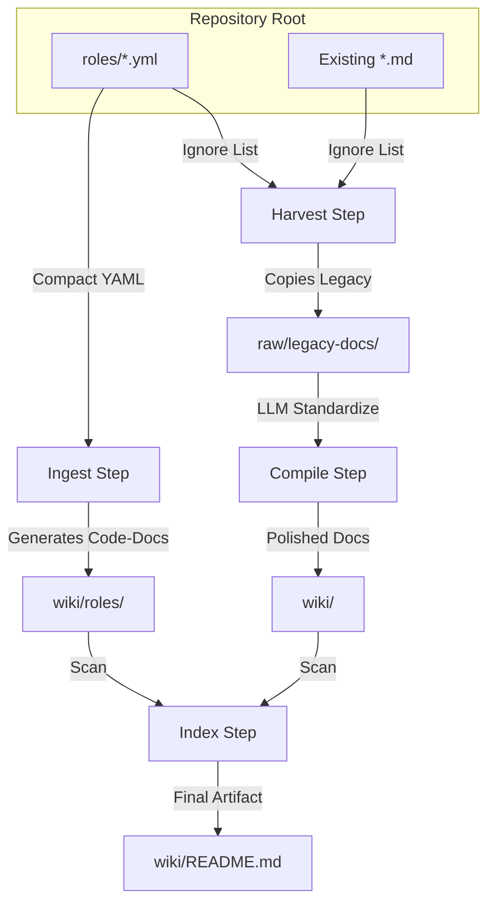

# Wiki Pipeline - LLM-Powered Documentation Generator

Automated, high-quality Markdown wiki generation for Ansible repositories using Ollama + LiteLLM. This pipeline follows a **Two-Stream Convergence** model:

1.  **Structural Stream**: Generates technical reference documentation directly from Ansible YAML code.
2.  **Contextual Stream**: Standardizes and preserves human-written legacy documentation (harvested `.md` files).

## Pipeline Workflow



## Features

* **Harvests legacy Markdown files**: Collects `README.md`, `TESTING.md`, and other docs from the repo into a raw staging area.
* **Smart ingestion of Ansible YAML**: Converts `roles/` logic into professional documentation using an LLM.
* **Two-Stream Convergence**: Merges technical auto-generated docs with polished legacy content.
* **Configurable LLM prompts**: Tailor the tone, temperature, and output format via `.wiki-config.yml`.
* **Hash-based Incremental Runs**: Uses fingerprints to skip unchanged roles, saving time and compute.

## Quick Start

```bash
# 1. Create config file
cp .wiki-config.example.yml .wiki-config.yml

# 2. Run the full pipeline
docker run --rm -v $(pwd):/workspace -w /workspace \
  lj020326/wiki-pipeline:latest \
  wiki-pipeline harvest && \
  wiki-pipeline ingest --changed-only && \
  wiki-pipeline compile && \
  wiki-pipeline index
```

## Directory Structure

| Directory          | Source           | Purpose                                                            |
|:-------------------|:-----------------|:-------------------------------------------------------------------|
| `raw/legacy-docs/` | `harvest`        | Staging area for original, unedited markdown files.                |
| `wiki/roles/`      | `ingest`         | LLM-generated technical references for Ansible roles.              |
| `wiki/`            | `compile`        | Final destination for standardized legacy docs and the wiki index. |
| `wiki/media/`      | `generate-media` | Charts, slides, and visualizations derived from the wiki content.  |

## Available Commands

| Command          | Stream      | Description                                                                | Key Flags                 |
|:-----------------|:------------|:---------------------------------------------------------------------------|:--------------------------|
| `harvest`        | Contextual  | Scans the repo for legacy `.md` and copies them to raw storage.            | "--output, --verbose"     |
| `ingest`         | Structural  | Analyzes YAML code to create technical role documentation.                 | "--limit, --changed-only" |
| `compile`        | Contextual  | Uses LLM to polish and standardize files in the raw storage into the wiki. | --verbose                 |
| `index`          | Convergence | Generates the master navigation and category-based README.                 | --verbose                 |
| `qa`             | Contextual  | Generate FAQ section                                                       | --verbose                 |
| `lint`           | Quality     | Performs LLM-powered quality checks across all generated files.            | "--fix, --verbose"        |
| `generate-media` | Contextual  | Placeholder for slides/charts                                              | --verbose                 |

---

### Key Convergence Notes:
* **Harvested markdowns** are no longer just static artifacts; they are treated as the "Contextual Stream" that `compile.py` uses as a source to ensure the final wiki doesn't lose the human touch of your original documentation.
* The **Structural Stream** (ingest) handles the heavy lifting of code-to-doc conversion, ensuring the technical specs stay up to date with your actual Ansible code.

## Full Pipeline Example (Recommended)

```Bash
wiki-pipeline harvest --verbose
wiki-pipeline ingest --changed-only --verbose
wiki-pipeline compile --verbose
wiki-pipeline lint --fix --verbose
wiki-pipeline index --verbose
```

## Jenkins Integration

See [`.jenkins/runWikiPipeline.groovy`](https://github.com/lj020326/pipeline-automation-lib/blob/main/vars/runWikiPipeline.groovy) for the full CI/CD pipeline that:

- Runs inside the Docker container 
- Uses --changed-only for speed 
- Commits changes with [skip ci]
- Respects internal LLM endpoint

## Docker Image

```Bash
lj020326/wiki-pipeline:latest
```

Built with:

- Python 3.12-slim 
- LiteLLM + Ollama support 
- Git, graphviz, ssh-agent 
- All scripts included

## Example .wiki-config

In your ansible git repository root:
```shell
cp .wiki-config.example.yml .wiki-config.yml
```

Then edit .wiki-config.yml to match your preferred roles_ignore / priority_roles
