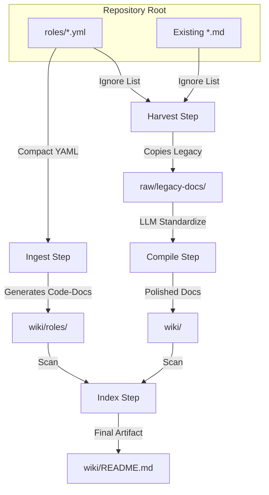

# Wiki Pipeline - LLM-Powered Documentation Generator

Automated, high-quality Markdown wiki generation for Ansible repositories using LiteLLM and fast, local code indexing. This pipeline follows a **Two-Stream Convergence** architecture integrated with upstream repository search indexing.

## Architecture & Workflow

1.  **Structural Stream**: Generates technical reference documentation directly from Ansible YAML code.
2.  **Contextual Stream**: Standardizes and preserves human-written legacy documentation (harvested `.md` files).

The pipeline separates structural code analysis from contextual documentation standardization, eliminating redundant LLM passes while leveraging upstream code symbol indices (`.code_index/`) for real dependency mapping.

```
                      ┌──────────────────────────────────────────────┐
                      │    runIndexerPipeline.groovy (Upstream)      │
                      │  Builds .code_index/ (ctags, tgrep, fts5)   │
                      └──────────────────────┬───────────────────────┘
                                             │
                                             ▼
┌──────────────────────────────────────────────────────────────────────────────────────────┐
│ Stage 1: INDEXING / SEARCH CONTEXT                                                       │
│  - Queries .code_index/code_search.db (SQLite FTS5) to discover cross-role usages,      │
│    role imports, and tasks across playbooks in milliseconds.                            │
└────────────────────────────────────────────┬─────────────────────────────────────────────┘
                                             │
                                             ▼
┌──────────────────────────────────────────────────────────────────────────────────────────┐
│ Stage 2: INGESTION & CONTEXTUAL COMPILATION                                              │
│  - Structural Stream (ingest): Ansible YAML -> Direct Single LLM Pass -> wiki/roles/*.md │
│  - Contextual Stream (compile): Legacy *.md -> Single LLM Standardize -> wiki/*.md       │
└────────────────────────────────────────────┬─────────────────────────────────────────────┘
                                             │
                                             ▼
┌──────────────────────────────────────────────────────────────────────────────────────────┐
│ Stage 3: HYBRID LINTING & INTEGRITY CHECK                                                │
│  - Stage 3a: Fast, deterministic checks (0s cost: AST/Regex for frontmatter, fences, etc) │
│  - Stage 3b: Optional LLM semantic QA and auto-fixing (`--fix`).                         │
└────────────────────────────────────────────┬─────────────────────────────────────────────┘
                                             │
                                             ▼
┌──────────────────────────────────────────────────────────────────────────────────────────┐
│ Stage 4: CONVERGENCE INDEXING                                                            │
│  - Generates top-level navigation index (`wiki/index.md`) and directory structure.       │
└──────────────────────────────────────────────────────────────────────────────────────────┘
```

## Directory Structure & Layout

```text
ansible-example-repo/
├── .code_index/            <-- Upstream search index (SQLite FTS5, Ctags, Trigram)
│   └── code_search.db
├── .wiki/                  <-- Staging area & pipeline state tracker
│   ├── .wiki-state.json    <-- Fingerprint state hashes
│   ├── lint-report.md      <-- Automated QA report
│   └── raw/                <-- Harvested legacy documentation
├── wiki/                   <-- Public Documentation Output
│   ├── index.md
│   └── roles/              <-- LLM-generated Ansible role documentation
├── .wiki-config.yml
├── inventory/
├── roles/
└── Jenkinsfile
```

## Pipeline Workflow


```mermaid
graph TD
    %% Source Data
    subgraph Repo_Root [Repository Root]
        A[roles/*.yml]
        B[Existing *.md]
    end

    %% Process: Harvest
    A -->|Ignore List| H[Harvest Step]
    B -->|Ignore List| H
    H -->|Copies Legacy| RD[raw/legacy-docs/]

    %% Process: Ingest
    A -->|Compact YAML| I[Ingest Step]
    I -->|Generates Code-Docs| WD[wiki/roles/]

    %% Process: Compile
    RD -->|LLM Standardize| C[Compile Step]
    C -->|Polished Docs| WD2[wiki/]

    %% Final Convergence
    WD -->|Scan| IX[Index Step]
    WD2 -->|Scan| IX
    IX -->|Final Artifact| OUT[wiki/README.md]
```

## Jenkins Pipeline to run wiki-pipeline

The execution of the wiki-pipeline can be managed via the Jenkins pipeline below:

* **[Jenkins Wiki Pipeline](https://github.com/lj020326/pipeline-automation-lib/blob/main/vars/runWikiPipeline.groovy)**

## Features

* **Single-Pass Ingestion:** Eliminates duplicate LLM compilation cycles by outputting production-ready role documentation during the ingestion pass.
* **Code Search Index Integration:** Queries upstream SQLite FTS5 database (`.code_index/code_search.db`) to automatically resolve and document role usage across repo playbooks.
* **Hybrid Deterministic & LLM Linting:** Instant, zero-cost AST/Regex structural verification paired with optional LLM semantic auto-correction (`--fix`).
* **Incremental Processing:** Fingerprint hashing skips unchanged source files, reducing token costs and execution time.
* **Smart ingestion of Ansible YAML**: Converts `roles/` logic into professional documentation using an LLM.
* **Two-Stream Convergence**: Merges technical auto-generated docs with polished legacy content.
* **Configurable LLM prompts**: Tailor the tone, temperature, and output format via `.wiki-config.yml`.
* **Hash-based Incremental Runs**: Uses fingerprints to skip unchanged roles, saving time and compute.

## Available Pipeline Commands

| Command          | Stage       | Description                                                                 | Key Flags                              |
|:-----------------|:------------|:----------------------------------------------------------------------------|:---------------------------------------|
| `harvest`        | Staging     | Collects existing repository Markdown files into `.wiki/raw/`.              | `--output`, `--verbose`                |
| `ingest`         | Structural  | Performs single-pass Ansible YAML code documentation using symbol index.      | `--limit`, `--changed-only`            |
| `compile`        | Contextual  | Standardizes and polishes legacy Markdown documentation into `wiki/`.       | `--changed-only`, `--verbose`          |
| `lint`           | QA          | Runs deterministic structural checks followed by optional LLM semantic QA.  | `--fix`, `--no-llm`, `--changed-only`  |
| `index`          | Convergence | Rebuilds wiki navigation and category taxonomy index (`wiki/index.md`).     | `--verbose`                            |

## Quick Start & Usage Example

```bash
# 1. Create configuration file
cp .wiki-config.example.yml .wiki-config.yml

# 2. Run standard automated execution
docker run --rm -v $(pwd):/workspace -w /workspace \
  lj020326/wiki-pipeline:latest \
    wiki-pipeline harvest && \
    wiki-pipeline ingest --changed-only && \
    wiki-pipeline compile --changed-only && \
    wiki-pipeline lint --changed-only --verbose && \
    wiki-pipeline index --verbose
```

## Fast Local Linting (No LLM Required)

To execute ultra-fast structural linting without invoking external LLM APIs:

```bash
wiki-pipeline lint --no-llm --verbose
```

## Directory Structure

| Directory          | Source           | Purpose                                                            |
|:-------------------|:-----------------|:-------------------------------------------------------------------|
| `raw/legacy-docs/` | `harvest`        | Staging area for original, unedited markdown files.                |
| `wiki/roles/`      | `ingest`         | LLM-generated technical references for Ansible roles.              |
| `wiki/`            | `compile`        | Final destination for standardized legacy docs and the wiki index. |
| `wiki/media/`      | `generate-media` | Charts, slides, and visualizations derived from the wiki content.  |

---

### Key Convergence Notes:
* **Harvested markdowns** are no longer just static artifacts; they are treated as the "Contextual Stream" that `compile.py` uses as a source to ensure the final wiki doesn't lose the human touch of your original documentation.
* The **Structural Stream** (ingest) handles the heavy lifting of code-to-doc conversion, ensuring the technical specs stay up to date with your actual Ansible code.

## Full Pipeline Example (Recommended)

```Bash
wiki-pipeline harvest --verbose
wiki-pipeline ingest --changed-only --verbose
wiki-pipeline compile --verbose
wiki-pipeline lint --fix --verbose
wiki-pipeline index --verbose
```

## Jenkins Integration

Managed Jenkins pipeline runner:
* **[Jenkins Wiki Pipeline Library (`runWikiPipeline.groovy`)](https://github.com/lj020326/pipeline-automation-lib/blob/main/vars/runWikiPipeline.groovy)**
* Integrates upstream indexer pipeline (`runIndexerPipeline.groovy`) prior to document generation.
* Commits updated wiki documentation with automated change detection.
* Runs inside the Docker container
* Uses --changed-only for speed
* Commits changes with [skip ci]
* Respects internal LLM endpoint

## Docker Image

```Bash
lj020326/wiki-pipeline:latest
```

Built with:

- Python 3.12-slim
- LiteLLM + Ollama support
- Git, graphviz, ssh-agent
- All scripts included

## Example .wiki-config

In your ansible git repository root:
```shell
cp .wiki-config.example.yml .wiki-config.yml
```

Then edit .wiki-config.yml to match your preferred roles_ignore / priority_roles
